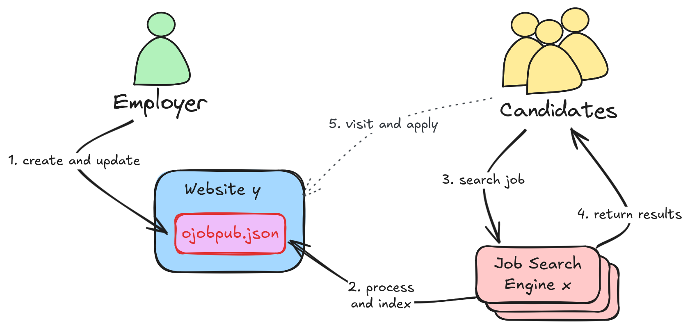

# About oJobPub

oJobPub is an open initiative to make it easy to publish job offers placing a JSON data file on a well defined path on your website. 

Benfits:

- **Indexed** by job search engines efficiently.
- **Found** by candidates more reliably.
- **Keep control** of your company's data and application process.
- **No additional costs** beyond what you already pay for your domain and web hosting.

