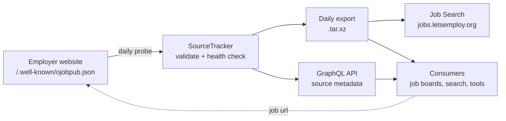

# Let's Employ Documentation

Technical documentation for **oJobPub**, an open JSON format for publishing job openings, and for the Let's Employ services built around it.

An employer publishes a single JSON document at a well-known URL on their own domain:

```
https://example.com/.well-known/ojobpub.json
```

The document contains minimal, structured metadata per opening. Each job links to a canonical page on the employer's site, where the full description and the application process stay. Consumers such as job boards, search engines and tools fetch the document directly or use the aggregated data from SourceTracker, like our [Job Search](resources/jobsearch.md) does.

## Data flow


```mermaid
flowchart LR
  P["Employer website<br>/.well-known/ojobpub.json"] -- "daily probe" --> S["SourceTracker<br>validate + health check"]
  S --> E["Daily export<br>.tar.xz"]
  S --> G["GraphQL API<br>source metadata"]
  E --> J["Job Search<br>jobs.letsemploy.org"]
  E --> C["Consumers<br>job boards, search, tools"]
  G --> C
  C -. "job url" .-> P
```

The export and the GraphQL API are free and require an [API token](consuming/index.md#api-token). [Job Search](resources/jobsearch.md) is our own consumer of the export.

## Where to start

| You want to… | Read |
| --- | --- |
| Publish your openings as oJobPub | [Publishing](publishing/index.md) |
| Use oJobPub data in your product | [Consuming](consuming/index.md) |
| Implement a parser or validator | [Specification](ojobpub/specification.md), [Field reference](ojobpub/schema.md) |
| Find the services and APIs | [Services](resources/index.md) |

For the motivation behind the project, see [letsemploy.org](https://www.letsemploy.org).
