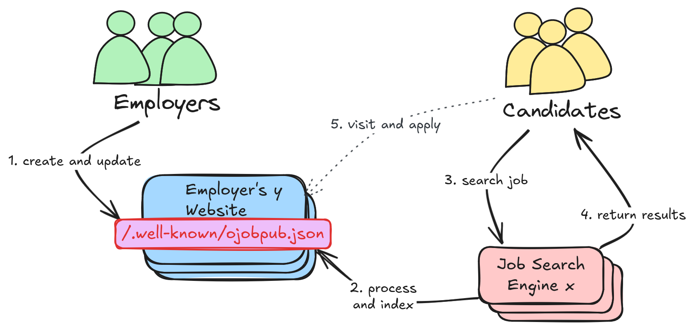

# About oJobPub

oJobPub is an initiative with the goal, to create a free, simple and efficient process to publish your vacancies on your own website and make it easy, simple and efficient to collect the data for everyone.

## Benfits

- [x] **Simple**: Employers manage open job positions on their own websites.
- [x] **Efficient**: Search engines collect structured data from a known path on employers' websites.
- [x] **Reliable**: Candidates find current vacancies more reliable and on many different job boards.
- [x] **In Control**: Employers keep control of their data and application process.
- [x] **No additional costs** beyond what employers already pay for your domain and web hosting.

## No Goals

- [ ] oJobPub.org is **not** meant to be *another job board*, even though we might publish collect jobs publish using oJobPub just as a *PoC*.
