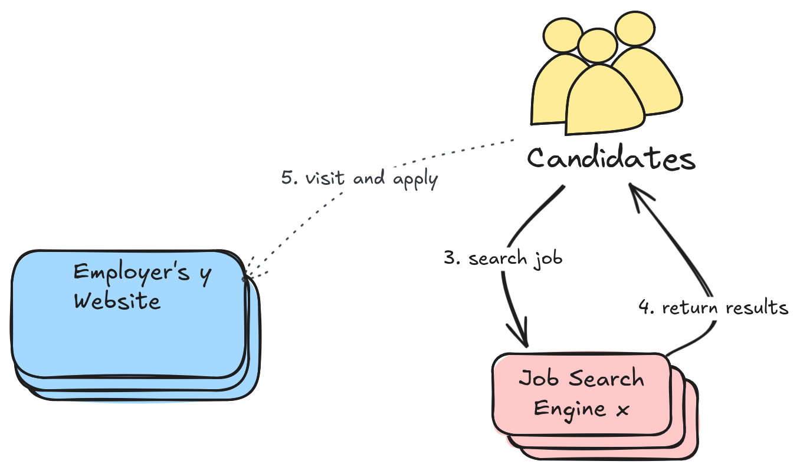

# Our Approach for Improvement

How we want to address the issues:

- Use your Website
- Structured Meta Data
- Well-Known Location
- Keep Control of the Application Process

## Use your Website

Having a website is almost a given for a company nowadays, and the cost of a website has never been lower than it is today.

We still believe that publishing job vacancies on your **own website is the best and most cost-effective solution**, as you have full control and the data belongs to you.

However, these published vacancies only get found by using search engines, but the experience in finding jobs using Google or any other common search engine is not great. We believe that something is missing. An element that makes it actually work and ensures that your job postings are found by applicants.

{ height="100" }

## Structured Meta Data

Because there's **no wide adopted standard format** for published job data on websites, job information can vary widely — from a simple list of jobs to a searchable input field to query jobs to an individual pages for each opening.

This lack of consistency and structure **makes it difficult for search engines** to accurately recognize the context as job openings.

While we still **want to keep our content** on our own website rather than on commercial platforms that sell our data, the challenge is **making that content discoverable**.

A simplistic, minimalistic, structured data file containing **meta information** about your job opening and a **link to your detailed job page** should be good enough!

## Predefined Path

Inspired by robots.txt or sitemap.xml, we place a metadata file at a **specific**, **predetermined path**, we can ensure that search engines looking for job openings **know exactly where to find the data**.

This means they are aware of the data's context, allowing them to optimize how often they revisit to update their index.

As a result, job openings can be indexed by **multiple search engines** without further efforts and without any additional cost.

{ height="100" }

## Keep the Control

The metadata you provide will be stored as an index by search engines, we can't control how long they keep that data.

That is why **only as much information as necessary** is provided. This strategy ensures that there is just enough information to pique a candidate's interest and **send them to the employer's website**.

This is crucial because employers keep **control of the application process**.

